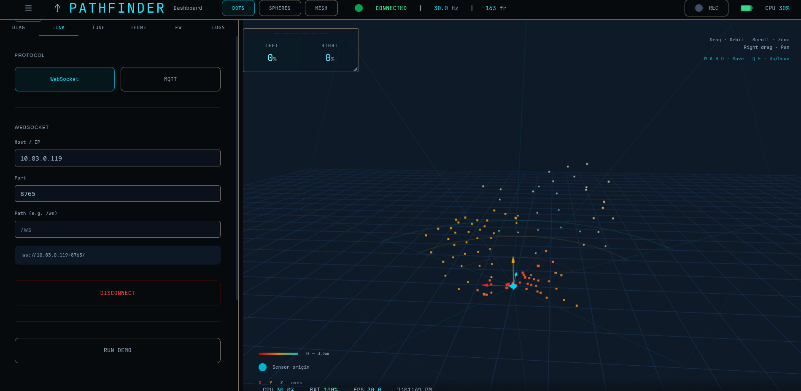

# Pathfinder - Confidence in every step


Pathfinder is a smart cane that utilizes time-of-flight sensors, vibration motors, and audio cues in order to aid visually impaired individuals.

This project was developed over the course of five weeks at the Universities at Shady Grove by four team members, that being:
- Artur Khachatrian (team leader)
- Bryndon Ekabe (lead software developer)
- Maximo Todo (CAD specialist)
- Dominic Ye (hardware specialist)

This repository contains the entirety of the source code for the CPSE Pathfinder project, both the ESP32 as well as the paired dashboard Vite application. Please note that this code is very rudimentary, and therefore crude, and this is mostly a proof-of-concept / early prototype at best. Also note that the dashboard was developed with the help of Figma Make, an AI assistant for building websites, mostly out of convenience, though the cane code was written by hand.

## Screenshots
These are some screenshots of the companion dashboard that we developed alongside the main ESP32 code.



## For developers

This section is for developers or individuals looking to recreate this project for themselves, all steps necessary are listed below.

### Cane
#### Project structure
The cane source code can be split up into parts:
- Hardware (`tof.cpp`, `motor.cpp`, `imu.cpp`, `speaker.cpp`)
- Wireless technologies (`websocket.cpp`, `bluetooth.cpp`)
- Core runtime logic (`runtime.cpp`)
- Compile-time configuration (`config.hpp`)
#### Prerequisites
- Arduino IDE and/or corresponding `arduino-cli` commands

If using `arduino-cli`, please use those corresponding commands, as this mainly covers Arduino IDE.

#### Installing dependencies
To install the libraries the code uses, follow these instructions:
1. Open Arduino IDE
2. Navigate to the top toolbar
3. Select Sketch -> Include library -> Add .ZIP library
4. Navigate to the `libs` folder inside the `cane` directory, and select your desired .ZIP file
5. Repeat for each library you need to install

#### Compiling and running
To compile the cane code, simply open the project, then click the checkmark icon in the top-left of the Arduino IDE, this will compile the code.

To run the code, simply click on the arrow that is to the right of the checkmark icon, this will flash the compiled code to your connected microcontroller. 

Please note that many boards will not be supported.

### Dashboard
#### Prerequisites
- Node.js (`node` command)
- Node package manage (`npm`)
- Any shell (`bash`, `zsh`, etc.)

#### Compiling and running

To compile the dashboard code, simply run this command while within the `dashboard` directory:
```bash
npm run build
```

To run the code, simply run this command while within the `dashboard` directory:
```bash
npm run dev
```

From there, simply navigate to the provided localhost URL in your browser, and you're done!
